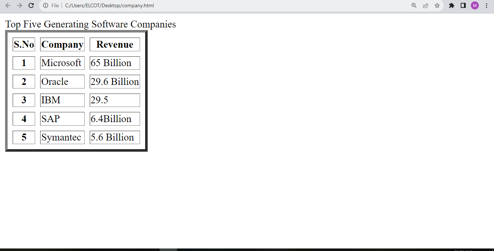
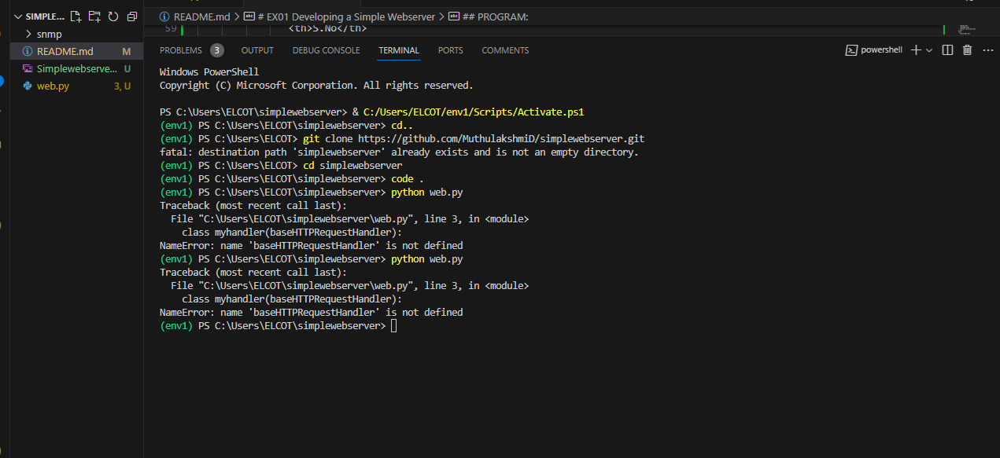

# EX01 Developing a Simple Webserver
## Date:

## AIM:
To develop a simple webserver to serve html pages.

## DESIGN STEPS:
### Step 1: 
HTML content creation.

### Step 2:
Design of webserver workflow.

### Step 3:
Implementation using Python code.

### Step 4:
Serving the HTML pages.

### Step 5:
Testing the webserver.

## PROGRAM:
```
from http.server import HTTPServer, BaseHTTPRequestHandler
content = """
<!DOCTYPE html>
<html>
  <title> image map</title>
     <body>
        <table border="4" cellspacing="8" cellspacing="7">
          <caption> TOP FIVE GENERATING SOFTWARE COMPANIES </caption>
            <tr>
               <th>S.No</th>
               <th>Company</th>
               <th>Revenue</th>
             </tr>
             <tr>
               <th>1</th>
               <td>Microsoft</td>
               <td>65 Billion</td>
             </tr>
             <tr>
               <th>2</th>
               <td>Oracle</td>
               <td>29.6 Billion</td>
             </tr>
             <tr>
               <th>3</th>
               <td>IBM</td>
               <td>29.1 Billion</td>
             </tr>
             <tr>
               <th>4</th>
               <td>SAP</td>
               <td>6.4 Billion</td>
             </tr>
             <tr>
               <th>S.No</th>
               <td>Symantec</td>
               <td>5.6 Billion</td>
             </tr>
           </table border>
      </body>
</html>
"""
class myhandler(BaseHTTPRequestHandler):
    def do_GET(self):
        print("request received")
        self.send_response(200)
        self.send_header('content-type', 'text/html; charset=utf-8')
        self.end_headers()
        self.wfile.write(content.encode())
server_address = ('',8000)
httpd = HTTPServer(server_address,myhandler)
print("my webserver is running...")
httpd.serve_forever()
```


## OUTPUT:


## RESULT:
The program for implementing simple webserver is executed successfully.
